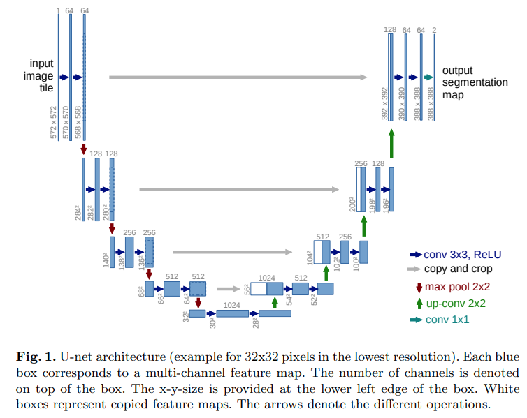

</img>

## x-unet

Implementation of a U-net complete with efficient attention as well as the latest research findings

## Install

```bash
$ pip install x-unet
```

## Usage

```python
import torch
from x_unet import XUnet

unet = XUnet(
    dim = 64,
    channels = 3,
    dim_mults = (1, 2, 4, 8),
    nested_unet_depths = (7, 4, 2, 1),     # nested unet depths, from unet-squared paper
    consolidate_upsample_fmaps = True,     # whether to consolidate outputs from all upsample blocks, used in unet-squared paper
)

img = torch.randn(1, 3, 256, 256)
out = unet(img) # (1, 3, 256, 256)
```

For 3d (video or CT / MRI scans)

```python
import torch
from x_unet import XUnet

unet = XUnet(
    dim = 64,
    frame_kernel_size = 3,                 # set this to greater than 1
    channels = 3,
    dim_mults = (1, 2, 4, 8),
    nested_unet_depths = (5, 4, 2, 1),     # nested unet depths, from unet-squared paper
    consolidate_upsample_fmaps = True,     # whether to consolidate outputs from all upsample blocks, used in unet-squared paper
    weight_standardize = True
)

video = torch.randn(1, 3, 10, 128, 128)    # (batch, channels, frames, height, width)
out = unet(video) # (1, 3, 10, 128, 128)
```

## Todo

- [ ] memory efficiency for 3d - reversible blocks, checkpointing, memory efficient unet
- [ ] offer option for axial convolutions (placing frame convolutions at end of the resnet chain)

## Citations

```bibtex
@article{Ronneberger2015UNetCN,
    title   = {U-Net: Convolutional Networks for Biomedical Image Segmentation},
    author  = {Olaf Ronneberger and Philipp Fischer and Thomas Brox},
    journal = {ArXiv},
    year    = {2015},
    volume  = {abs/1505.04597}
}
```

```bibtex
@article{Qin2020U2NetGD,
    title   = {U2-Net: Going Deeper with Nested U-Structure for Salient Object Detection},
    author  = {Xuebin Qin and Zichen Vincent Zhang and Chenyang Huang and Masood Dehghan and Osmar R Zaiane and Martin J{\"a}gersand},
    journal = {ArXiv},
    year    = {2020},
    volume  = {abs/2005.09007}
}
```

```bibtex
@inproceedings{Henry2020QueryKeyNF,
    title   = {Query-Key Normalization for Transformers},
    author  = {Alex Henry and Prudhvi Raj Dachapally and Shubham Vivek Pawar and Yuxuan Chen},
    booktitle = {FINDINGS},
    year    = {2020}
}
```

```bibtex
@article{Qiao2019WeightS,
    title   = {Weight Standardization},
    author  = {Siyuan Qiao and Huiyu Wang and Chenxi Liu and Wei Shen and Alan Loddon Yuille},
    journal = {ArXiv},
    year    = {2019},
    volume  = {abs/1903.10520}
}
```

```bibtex
@article{Shleifer2021NormFormerIT,
    title   = {NormFormer: Improved Transformer Pretraining with Extra Normalization},
    author  = {Sam Shleifer and Jason Weston and Myle Ott},
    journal = {ArXiv},
    year    = {2021},
    volume  = {abs/2110.09456}
}
```

```bibtex
@article{Sunkara2022NoMS,
    title   = {No More Strided Convolutions or Pooling: A New CNN Building Block for Low-Resolution Images and Small Objects},
    author  = {Raja Sunkara and Tie Luo},
    journal = {ArXiv},
    year    = {2022},
    volume  = {abs/2208.03641}
}
```

```bibtex
@inproceedings{Woo2023ConvNeXtVC,
    title   = {ConvNeXt V2: Co-designing and Scaling ConvNets with Masked Autoencoders},
    author  = {Sanghyun Woo and Shoubhik Debnath and Ronghang Hu and Xinlei Chen and Zhuang Liu and In-So Kweon and Saining Xie},
    year    = {2023}
}
```
